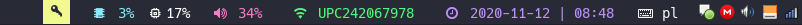

# Polybar-Yubikey

The script aims to output an indicator if the yubikey is waiting for a touch.

## Requirements

- [yubikey-touch-detector](https://github.com/maximbaz/yubikey-touch-detector): tool to detect when YubiKey is waiting for a touch
- (optionally) [Nerd Fonts](https://github.com/ryanoasis/nerd-fonts) if you want to use key glyph from example configuration

## Installation

1. Clone this repository (or the script alone) into directory of your choice
2. Add executable permission to it (`chmod +x yubikey_status.py`)
3. Reference it in the polybar configuration (see [example](#example-configuration) below).

## Arguments

- `-l, --label-key <str>` - label to indicate that yubikey is waiting for a touch
- `-n, --label-no-key <str>` - label to indicate that yubikey is **NOT** waiting for a touch

## Example configuration

```ini
[module/yubikey]
type = custom/script
exec = ~/.config/polybar/polybar-yubikey/yubikey_status.py -l 
tail = true
```

See full configuration [here](https://github.com/inv4d3r/polybar-config/)

## Screenshot


